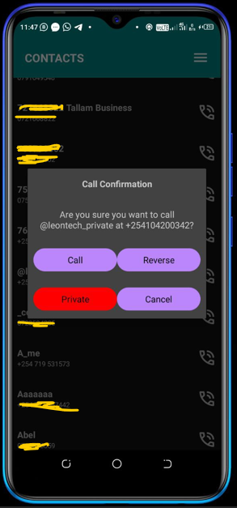

# AnonymousDial

AnonymousDial is an Android application tailored for users with Kenyan phone numbers, offering the convenience of both call reversal and anonymous calling. With a focus on simplicity and efficiency, AnonymousDial allows users to effortlessly reverse outgoing calls with just a tap, eliminating the need for manual entry of codes like #07. Additionally, the app empowers users to make calls using a private number, ensuring privacy and anonymity when desired. Whether you need to reverse a call or make an anonymous call, AnonymousDial provides a seamless solution for your calling needs.

## key Features
1. Call reversal: Quickly reverse outgoing calls with a simple tap, eliminating the need for manual code entry like #07.
2. Anonymous calling: Make calls using a private number to protect your privacy and identity.
3. Kenyan phone number support: Specifically tailored for users with Kenyan phone numbers, ensuring compatibility and reliability.
4. User-friendly interface: Intuitive design makes it easy for users to navigate and utilize the app's features efficiently.
5. Secure and reliable: Built with a focus on security and reliability to ensure a seamless user experience.

## Contributing

Contributions are welcome! If you have any suggestions, feature requests, or bug reports, please open an issue or submit a pull request.

## Contact

For any inquiries or support, please contact [martinleontech23@gmail.com](mailto:martinleontech23@gmail.com).

## Snaps

